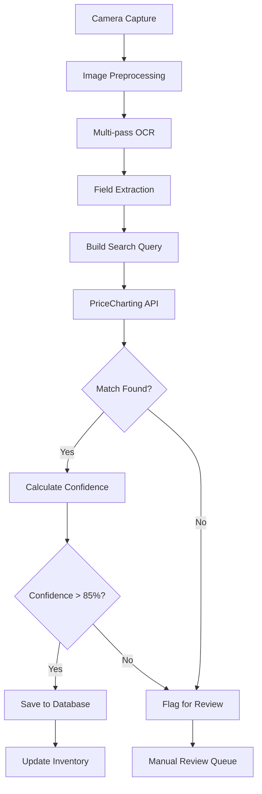

# CardMint Enhanced OCR & Pricing Integration Plan

## Executive Summary

This document outlines the integration of PriceCharting API with CardMint's OCR pipeline to create a comprehensive Pokemon card inventory management system. The focus is on achieving 98%+ OCR accuracy for card identification and real-time market pricing.

## 1. PriceCharting API Integration

### 1.1 API Configuration

**Environment Variables (.env):**
```bash
PRICECHARTING_API_KEY=0a312991655c1fcab8be80b01e016fe3e9fcfffc
PRICECHARTING_CACHE_TTL=86400  # 24 hours
PRICECHARTING_BASE_URL=https://www.pricecharting.com
```

### 1.2 Available Endpoints

**Product Search:**
- `/api/product` - Search by ID, UPC, or query
- `/api/products` - Search multiple products by text
- `/price-guide/download-custom` - CSV bulk download

**Response Data Fields:**
```javascript
{
  id: number,                    // PriceCharting product ID
  console_name: string,          // Set name (e.g., "Pokemon Base Set")
  product_name: string,          // Card name with number (e.g., "Charizard #4")
  loose_price: number,           // Ungraded price (in cents)
  graded_price: number,          // Generic graded price
  bgs_10_price: number,          // BGS 10 price
  condition_17_price: number,    // PSA 9 price
  condition_18_price: number,    // PSA 10 price
  new_price: number,             // Sealed/mint price
  sales_volume: number,          // Recent sales count
  tcg_id: string,               // TCGPlayer ID for cross-reference
  release_date: string          // Original release date
}
```

### 1.3 Price Conversion

All prices are returned in cents. Convert to dollars:
```javascript
const priceInDollars = priceInCents / 100;
```

## 2. Pokemon Card Anatomy & OCR Targets

### 2.1 Primary Fields (98%+ Accuracy Required)

| Field | Location | Example | Pattern |
|-------|----------|---------|---------|
| Card Name | Top center | "Lightning Dragon" | Text, largest font |
| Set Number | Bottom | "123/350" | `\d+/\d+` |
| Set Code | Bottom | "SV01" | `[A-Z]{2,4}\d{0,3}` |
| Rarity Symbol | Bottom corner | ⚫◆⭐ | Symbol recognition |

### 2.2 Secondary Fields (95%+ Accuracy Target)

| Field | Location | Example | Pattern |
|-------|----------|---------|---------|
| HP | Top right | "HP 120" | `HP\s*(\d+)` |
| Stage | Below name | "Stage 2" | `(Basic\|Stage\s+[12])` |
| Type Symbol | Next to HP | 🔥⚡💧 | Energy symbol |
| Attack Names | Middle | "Thunder Strike" | Text lines |
| Attack Damage | Right of attack | "120" | `\d+` |
| Energy Cost | Left of attack | ⚡⚡○ | Symbol count |

### 2.3 Tertiary Fields (Nice to Have)

- Weakness/Resistance (bottom left)
- Retreat Cost (bottom right)
- Illustrator Name (bottom)
- Pokédex Entry (flavor text)
- Regulation Mark (letter in box)

### 2.4 Special Identifiers

**Edition Markers:**
- "1st Edition" stamp (bottom left)
- "Shadowless" (visual inspection)
- Promo stamps

**Variant Types:**
- Holo/Reverse Holo (surface reflection)
- Full Art (extended artwork)
- Secret Rare (number > set total)
- Rainbow/Gold (visual detection)

## 3. OCR Processing Pipeline

### 3.1 Image Preprocessing

```python
def preprocess_card_image(image):
    # 1. Deskew correction
    # 2. Adaptive histogram equalization
    # 3. Bilateral filtering (denoise)
    # 4. Edge-preserving sharpening
    # 5. Region segmentation
    return processed_image
```

### 3.2 Multi-Pass OCR Strategy

**Pass 1: Standard Processing**
- Full preprocessing pipeline
- PP-OCRv5 server models
- High accuracy mode

**Pass 2: Original Image**
- Minimal preprocessing
- Different model parameters
- Capture alternate readings

**Confidence Aggregation:**
- Compare results from both passes
- Weight by confidence scores
- Flag discrepancies for review

### 3.3 Pokemon-Specific Patterns

```python
POKEMON_PATTERNS = {
    'card_number': r'#?\d+(?:/\d+)?',           # #4 or 123/350
    'set_code': r'[A-Z]{2,4}\d{0,3}',           # SV01, BASE, etc.
    '1st_edition': r'(?:1st\s+Edition|Edition\s+1)',
    'rarity': r'(?:Holo|Reverse|Full\s+Art|Secret\s+Rare)',
    'hp': r'HP\s*(\d+)',
    'stage': r'(?:Basic|Stage\s+[12]|BREAK|EX|GX|V|VMAX|VSTAR)',
    'energy': r'[🔥⚡💧🌿👊🔮⚙️🌑🧚🐉]',       # Energy symbols
    'retreat': r'Retreat\s*Cost.*?([🔴⚪]+)',   # Retreat cost
}
```

## 4. Card Matching Algorithm

### 4.1 Search Query Construction

```javascript
function buildSearchQuery(ocrResult) {
    // Priority order for query building
    const query = [];
    
    if (ocrResult.card_name) query.push(ocrResult.card_name);
    if (ocrResult.set_name) query.push(ocrResult.set_name);
    if (ocrResult.card_number) query.push(ocrResult.card_number);
    
    return query.join(' ');
}
```

### 4.2 Match Confidence Scoring

```javascript
function calculateMatchConfidence(ocrResult, apiResult) {
    let score = 0;
    
    // Exact name match: 40 points
    if (fuzzyMatch(ocrResult.card_name, apiResult.product_name) > 0.9) {
        score += 40;
    }
    
    // Card number match: 30 points
    if (ocrResult.card_number && apiResult.product_name.includes(ocrResult.card_number)) {
        score += 30;
    }
    
    // Set name match: 20 points
    if (fuzzyMatch(ocrResult.set_name, apiResult.console_name) > 0.8) {
        score += 20;
    }
    
    // Edition/variant match: 10 points
    if (matchesVariant(ocrResult, apiResult)) {
        score += 10;
    }
    
    return score; // Threshold: 85+ for auto-match
}
```

### 4.3 Manual Review Triggers

Cards requiring manual review:
- Match confidence < 85%
- High value (>$100)
- 1st Edition or special variants
- Multiple potential matches
- No API match found
- OCR confidence < 85%

## 5. Database Schema

### 5.1 Enhanced Cards Table

```sql
CREATE TABLE cards (
    -- Primary identification
    id SERIAL PRIMARY KEY,
    uuid UUID DEFAULT gen_random_uuid(),
    
    -- OCR extracted fields
    card_name VARCHAR(255) NOT NULL,
    set_name VARCHAR(255),
    set_code VARCHAR(20),
    card_number VARCHAR(50),
    set_total INTEGER,
    rarity VARCHAR(50),
    hp INTEGER,
    pokemon_type VARCHAR(50),
    stage VARCHAR(50),
    
    -- Card details
    attacks JSONB,  -- [{name, damage, energy_cost, effect}]
    abilities JSONB,  -- [{name, effect}]
    weakness VARCHAR(50),
    resistance VARCHAR(50),
    retreat_cost INTEGER,
    pokedex_entry TEXT,
    illustrator VARCHAR(100),
    regulation_mark CHAR(1),
    
    -- Variant information
    is_first_edition BOOLEAN DEFAULT FALSE,
    is_shadowless BOOLEAN DEFAULT FALSE,
    is_holo BOOLEAN DEFAULT FALSE,
    is_reverse_holo BOOLEAN DEFAULT FALSE,
    variant_type VARCHAR(50),  -- full_art, secret_rare, etc.
    
    -- PriceCharting integration
    pricecharting_id INTEGER,
    pricecharting_name VARCHAR(255),
    tcg_id VARCHAR(50),
    
    -- Pricing data (in cents)
    loose_price INTEGER,
    graded_price INTEGER,
    new_price INTEGER,
    psa_10_price INTEGER,
    psa_9_price INTEGER,
    bgs_10_price INTEGER,
    market_price INTEGER,  -- Calculated average
    last_price_update TIMESTAMP,
    price_trend VARCHAR(20),  -- up, down, stable
    
    -- Physical inventory
    condition VARCHAR(50) DEFAULT 'near_mint',
    quantity INTEGER DEFAULT 1,
    location VARCHAR(255),
    storage_box VARCHAR(100),
    sleeve_type VARCHAR(50),
    
    -- Tracking
    qr_code VARCHAR(100) UNIQUE,
    batch_number VARCHAR(100),
    acquisition_date DATE,
    acquisition_price DECIMAL(10,2),
    source VARCHAR(100),  -- where acquired from
    
    -- Processing metadata
    image_path TEXT NOT NULL,
    ocr_confidence DECIMAL(5,2),
    match_confidence INTEGER,
    processing_time_ms INTEGER,
    ocr_raw_result JSONB,
    
    -- Quality control
    needs_review BOOLEAN DEFAULT FALSE,
    review_reason VARCHAR(255),
    reviewed_by VARCHAR(100),
    reviewed_at TIMESTAMP,
    
    -- Photo metadata
    photo_metadata JSONB,  -- brightness, sharpness, dimensions
    camera_settings JSONB,
    capture_timestamp TIMESTAMP,
    
    -- Timestamps
    created_at TIMESTAMP DEFAULT NOW(),
    updated_at TIMESTAMP DEFAULT NOW()
);

-- Indexes for performance
CREATE INDEX idx_card_name ON cards(card_name);
CREATE INDEX idx_set_code ON cards(set_code);
CREATE INDEX idx_card_number ON cards(card_number);
CREATE INDEX idx_pricecharting_id ON cards(pricecharting_id);
CREATE INDEX idx_needs_review ON cards(needs_review);
CREATE INDEX idx_qr_code ON cards(qr_code);
CREATE INDEX idx_batch_number ON cards(batch_number);
CREATE INDEX idx_condition ON cards(condition);
CREATE INDEX idx_created_at ON cards(created_at DESC);

-- Full-text search
CREATE INDEX idx_card_search ON cards USING gin(to_tsvector('english', 
    card_name || ' ' || COALESCE(set_name, '') || ' ' || COALESCE(pokedex_entry, '')));
```

### 5.2 Price History Table

```sql
CREATE TABLE price_history (
    id SERIAL PRIMARY KEY,
    card_id INTEGER REFERENCES cards(id) ON DELETE CASCADE,
    pricecharting_id INTEGER,
    loose_price INTEGER,
    graded_price INTEGER,
    psa_10_price INTEGER,
    sales_volume INTEGER,
    recorded_at TIMESTAMP DEFAULT NOW(),
    
    CONSTRAINT unique_price_record UNIQUE(card_id, recorded_at)
);

CREATE INDEX idx_price_history_card ON price_history(card_id);
CREATE INDEX idx_price_history_date ON price_history(recorded_at DESC);
```

## 6. Processing Workflow

### 6.1 Real-time Card Processing



### 6.2 Batch Processing Mode

1. **Morning Sync (6 AM)**:
   - Download PriceCharting CSV
   - Update all card prices
   - Generate price change alerts

2. **Hourly Updates**:
   - Process pending captures
   - Update high-value cards via API
   - Clear review queue

3. **Daily Reports**:
   - Inventory valuation
   - Processing statistics
   - Error/review summary

## 7. Testing Protocol

### 7.1 Test Dataset Structure

```
test_cards/
├── modern/          # 10 recent set cards (Scarlet & Violet)
├── vintage/         # 10 Base Set era cards
├── special/         # 5 promos, 1st editions
├── damaged/         # 5 cards with wear
├── holos/          # 5 holo/reverse holos
└── graded/         # 5 sleeved/toploaded cards
```

### 7.2 Testing Metrics

**OCR Accuracy by Field:**
- Card name: Target 98%+
- Set number: Target 98%+
- Set code: Target 95%+
- HP value: Target 95%+
- Rarity: Target 90%+

**Processing Performance:**
- End-to-end: <3 seconds
- OCR only: <1 second
- API lookup: <500ms
- Database save: <100ms

**Match Success Rate:**
- Modern cards: >95%
- Vintage cards: >90%
- Special editions: >85%
- Overall: >90%

### 7.3 Validation Checklist

For each test card, verify:
- [ ] Image captured clearly
- [ ] OCR extracts card name
- [ ] Set information detected
- [ ] Card number parsed correctly
- [ ] PriceCharting match found
- [ ] Prices retrieved and stored
- [ ] Confidence scores calculated
- [ ] Review flags set appropriately
- [ ] Processing time within limits

## 8. Implementation Timeline

### Week 1: Foundation
- [x] Day 1: Store API key securely
- [ ] Day 2: Create PriceCharting service module
- [ ] Day 3: Implement API search and caching
- [ ] Day 4: Build Pokemon-specific OCR patterns
- [ ] Day 5: Test with synthetic cards

### Week 2: Integration
- [ ] Day 6-7: Card matching algorithm
- [ ] Day 8-9: Database schema deployment
- [ ] Day 10: Connect OCR to pricing

### Week 3: Testing
- [ ] Day 11-12: Real card testing (40 cards)
- [ ] Day 13: Performance optimization
- [ ] Day 14: Manual review interface
- [ ] Day 15: Bug fixes and refinement

### Week 4: Production
- [ ] Day 16-17: Batch processing setup
- [ ] Day 18-19: Reporting and analytics
- [ ] Day 20: Documentation and training
- [ ] Day 21: Production deployment

## 9. Success Metrics

### Technical KPIs
- OCR accuracy: 98%+ on primary fields
- API match rate: 90%+ overall
- Processing speed: <3 seconds end-to-end
- System uptime: 99.9%
- Manual review rate: <5%

### Business KPIs
- Cards processed: 1,000+ per day capability
- Inventory accuracy: 99%+
- Price update frequency: Daily
- Value tracking: Real-time
- Report generation: <1 minute

## 10. Future Enhancements

### Phase 2 Features
- Mobile app for quick lookups
- Barcode/QR generation for boxes
- Multi-language card support
- Condition grading assistant
- Trade value calculator

### Phase 3 Features
- ML-based card recognition
- Automatic condition assessment
- Price prediction models
- Collection analytics
- Export to TCGPlayer/eBay

## Appendix A: Common Card Patterns

### Set Codes by Era
- Base Set Era: BASE, JU, FO, TR
- Neo Era: N1, N2, N3, N4
- E-Card Era: AQ, SK, EX
- Modern Era: SV, SS, SM, XY

### Rarity Symbols
- ⚫ Common
- ◆ Uncommon  
- ⭐ Rare
- ⭐H Rare Holo
- ⭐⭐ Double Rare
- ⭐⭐⭐ Triple Star

## Appendix B: API Examples

### Search for Card
```bash
curl "https://www.pricecharting.com/api/products?t=API_KEY&q=charizard+base+set+4"
```

### Get Specific Product
```bash
curl "https://www.pricecharting.com/api/product?t=API_KEY&id=630417"
```

### Download Full Database
```bash
curl "https://www.pricecharting.com/price-guide/download-custom?t=API_KEY&category=pokemon-cards" > pokemon_prices.csv
```

---

*Document Version: 1.0*
*Last Updated: 2025-08-14*
*Author: CardMint Development Team*